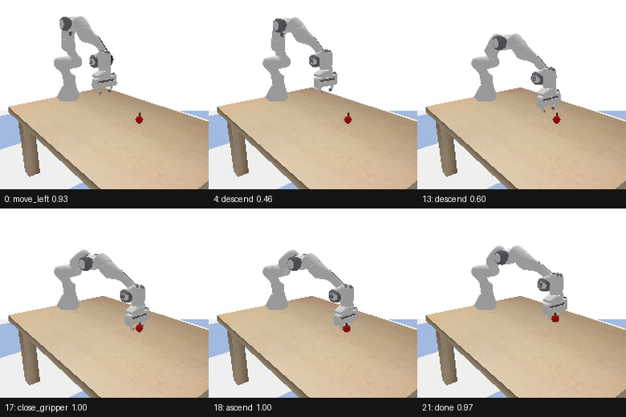

# Jev drives a robot arm

A Franka Panda in PyBullet picks an apple off a table. Every action the arm
takes is chosen by `typesafe/jev-1.13` — one `choice` question per control
step, whose options *are* the robot's tool calls.



```
  0  move_left      conf 0.93  held 0.02  | far forward, far to the left, below the gripper
  4  descend        conf 0.46  held 0.02  | far forward, lined up, below the gripper
 13  descend        conf 0.60  held 0.02  | slightly forward, lined up, below the gripper
 17  close_gripper  conf 1.00  held 0.03  | lined up, lined up, level with the gripper
 18  ascend         conf 1.00  held 0.87  | lined up, lined up, level with the gripper
 21  done           conf 0.97  held 0.92  | lined up, lined up, level with the gripper

PICKED UP THE APPLE after 22 steps (Jev called done); apple at z=0.726 (table 0.626)
```

**6/6 apple placements picked up**, 14–24 steps each, $0.0065 of Jev for the
whole sweep.

## Run it

```sh
pip install pybullet numpy pillow
export OPENROUTER=sk-or-...

python3 -m jevbot.run --apple 0.40,0.10 --frames /tmp/frames   # one episode
python3 -m jevbot.eval                                         # all six placements
python3 -m jevbot.ablation                                     # the state-framing result
```

## How it fits together

| File | Job |
| --- | --- |
| `sim.py` | Panda + table + apple. `ACTIONS` is the tool-call table. |
| `perception.py` | Camera frame → the facts the policy is allowed to know. |
| `policy.py` | The Jev request: actions as choice options, plus two nouls. |
| `run.py` | The control loop. |
| `eval.py` | Six placements, success rate. |
| `ablation.py` | Numeric vs worded state, measured. |

### The tool calls are the categories

`ACTIONS` in `sim.py` is both the robot's API and Jev's answer space — the nine
entries become the `criteria` of one `choice` question, so selecting an action
is a single structured decision rather than parsed text:

```python
"close_gripper": "Close the fingers to grip the apple. Pick this when the "
                 "gripper is horizontally over the apple AND at the right "
                 "height to grip it AND the fingers are still open.",
```

Each option's text is a *precondition*, not a description. That follows the
documented [literal-reading](https://docs.typesafe.ai/model-jaggedness/jev-1.13)
failure mode: "write the exact condition, criteria for each available option."

Two `noul` questions (`centred`, `holding`) ride in the same request. Batching
is cheaper and faster than separate calls
([speculative fan-out](https://docs.typesafe.ai/patterns/fan-out)); the loop
logs them as a second opinion on what the arm believes it is doing.

### What the model is allowed to see

Jev is text-only — "Images, audio, and video are not supported (yet)" — so the
pixels stop at `perception.py`. It finds the apple by red-channel dominance,
takes the median depth over the blob, unprojects that to world coordinates, and
pushes one apple-radius along the camera ray to reach the centre (**~1cm** of
the true pose). The gripper pose comes from forward kinematics, and whether
something is held comes from the fingers stalling short of closed — both real
proprioception.

The apple's true pose exists in `sim.py` but is never passed to the policy. It
scores the run and nothing else.

### Why the state is worded, not numeric

The first working version handed Jev `dx_forward_m: 0.20` and asked which way to
move. Left/right came back a coin flip — 0.33 vs 0.32 — which is the documented
behaviour: Jev is "not a calculator" and does better on "semantic
representations than numeric". So the thresholds moved into `perception.py` and
the model now reads `"far to the left of the gripper"`.

`ablation.py` runs both framings through the same situations with the same
criteria:

```
numeric state: 5/7 correct, mean confidence 0.62
worded state:  7/7 correct, mean confidence 0.85
```

The two numeric failures are sign errors — "apple far right" answered
`move_left`, and a small left offset answered `descend`.

This is a division of labour, not a workaround. Geometry and thresholds are
arithmetic, and belong in code. What is left for Jev is the part that is
genuinely a judgement: which correction matters most right now, whether to
keep closing the gap or commit to the grasp, and when the job is finished.

### Calibration earns its keep

Confidence tracks the real ambiguity. During the diagonal approach, when
`descend` and `move_forward` are both defensible, it sits near 0.5 and the
choice alternates between them — which is a perfectly good approach path. At
the decisive moments it goes hard: `close_gripper` 1.00, `ascend` 1.00,
`done` 0.97. The `holding` noul flips 0.03 → 0.87 on the step the fingers
actually close, without ever being told the grasp succeeded.

## Caveats

- One fixed camera, one apple, no clutter and no occlusion. The red-blob
  detector would need replacing for a real scene.
- Top-down grasps only; the wrist never rotates.
- The apple is 5.2cm across because the Panda's fingers open to 8cm. At the
  7cm first tried, alignment tolerance was under the perception error.
- Placements are kept inside the arm's reach. Beyond it the arm stalls, and the
  loop reports "at its reach limit" rather than pretending the move happened.
